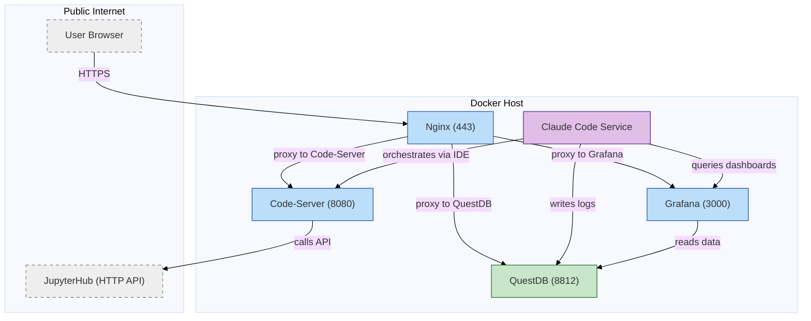

# Claude Code Integration for AI Agent Host

This folder contains the files needed to integrate **Claude Code** into the AI Agent Host by extending the existing Code-Server container.  

It enables Claude Code to directly interact with Code-Server, QuestDB and Grafana over the internal Docker network, while preserving the AI Agent Host as an **agentic environment**.

## Architecture Philosophy

**Important**: The AI Agent Host is **pure infrastructure** - it contains no AI models or agents. This integration simply adds Claude Code as a client that can utilize the infrastructure's capabilities.

**AI Agent Host** = Infrastructure Platform
- Containers, databases, networking, visualization tools
- Model-agnostic and framework-agnostic
- Can work with Claude Code, local LLMs, or any AI with system access

**Claude Code** = AI Layer  
- Brings intelligence to the infrastructure
- Uses the platform's capabilities (QuestDB, Grafana, file system)
- Could be replaced with other AI solutions

This separation ensures the infrastructure remains reusable and future-proof.

To apply this integration, replace the corresponding files in the main `docker` directory with the updated versions provided here.

From the  Code-Server web application, run the command `claude` in the terminal and follow the instructions

## Why This Environment Is Unique

This agentic environment is uncommon. Most AI deployments operate in:

**Typical AI environments:**
- Text-only conversational interfaces
- Read-only code analysis
- Sandboxed execution with limited capabilities
- Interactions mediated through frameworks or APIs with restrictions

**Key differences in this environment:**
- **Direct system access** – Bash execution, file modification, and network calls are permitted.
- **Multi-container orchestration** – Services communicate directly over the Docker network.
- **Persistent state changes** – Actions can permanently alter the system.
- **No strict sandboxing** – Real database operations and file modifications are possible.
- **Infrastructure control** – Interaction with production-like services is supported.

This level of autonomy and system access is generally limited to:
- Senior developers with full system privileges
- DevOps automation workflows
- CI/CD pipelines
- Infrastructure-as-code tools

In most AI environments, it is not possible to:
- Execute live `curl` requests against databases
- Modify running services
- Perform system-level operations with real-world impact

This configuration enables **true autonomous task execution** rather than limited, sandboxed demonstrations.

## Security Guidelines

**Run the AI Agent Host on dedicated, isolated hardware only.**

Since AI agents have full system access, use a standalone development box that is not shared with other workloads or production systems.

### Recommended Hardware Configurations

**Dedicated DevBox**
- **Microserver**: Refurbished HP Microserver Gen8 with quad-core Intel processor and 3 Ethernet ports  
- **CPU**: quad-core: Xeon E3-1260L, Xeon E3-1265L V2, Xeon E3-1220 V2, Xeon E3-1225 V2, Xeon E3-1230 V2, Xeon E3-1240 V2, Xeon E3-1270 V2  
- **RAM**: 16GB (2x8GB) Dual Rank x8 PC3-12800E (DDR3-1600) Unbuffered CAS-11 669324-B21  
- **SSD**: 1 × 250GB Samsung 860 EVO  
- **HDD**: 4 × 1TB Western Digital Enterprise Storage  
- **RAID Controller**: HP P410/512MB  

*This configuration has been tested with the full AI Agent Host stack including QuestDB, Grafana, Claude Code, and all productivity tools.*  

**Edge / Low-Power Alternative**
- Raspberry Pi 4 or Raspberry Pi 5 — suitable for IoT, field deployments, and lightweight agent tasks.

 ### Backup and Recovery

Implement RAID 10 and automated backups to protect against AI agent destructive commands.

  - RAID 10 Configuration: Use 4 HDDs in RAID 10 for optimal performance and redundancy
  - rsnapshot Integration: Automated incremental snapshots of critical directories and Docker volumes
  - Recovery Strategy: Quick rollback capability for AI agent mistakes and system corruption

  For complete RAID 10 setup and rsnapshot configuration: [Tutorial](https://github.com/quantiota/AI-Agent-Farm/tree/master/doc/it-admin/backup)

  ### System Monitoring

  Monitor AI Agent Host infrastructure with built-in Prometheus and Node Exporter.

  The AI Agent Host includes comprehensive monitoring for security and performance oversight:

  - Node Exporter: System metrics collection (CPU,memory, disk, network)
  - Prometheus Database: Time-series metric storage and alerting
  - Grafana Dashboard: Pre-configured Node Exporter Full dashboard (ID 1860)

  Security Monitoring Benefits:
  - Resource usage tracking: Detect abnormal AI agent resource consumption
  - System health alerts: Early warning of hardware failures or security issues
  - Performance baseline: Establish normal operation patterns for anomaly detection
  - Audit correlation: Cross-reference system metrics with AI conversation logs

### Remote Access Security

  Access AI Agent Host services remotely via HTTPS for enhanced security.

  Remote access to the three core services is strongly recommended over local development:

  - VSCode (Code-Server): https://vscode.yourdomain.tld - Secure web-based IDE
  - QuestDB: https://questdb.yourdomain.tld - Database management interface
  - Grafana: https://grafana.yourdomain.tld - Monitoring and analytics dashboard

  Security Benefits:

  - Isolation: AI agents run on dedicated hardware, not personal devices
  - Encryption: All traffic secured via SSL/TLS certificates
  - Audit Trail: Complete logging of all AI agent interactions
  - Recovery: Instant rollback capability protects against destructive commands
  - Data Protection: Personal and development data remain separate

  Remote access eliminates the security risks of running AI agents on shared personal laptops while
   providing enterprise-grade development capabilities.

## Screenshot

 

 