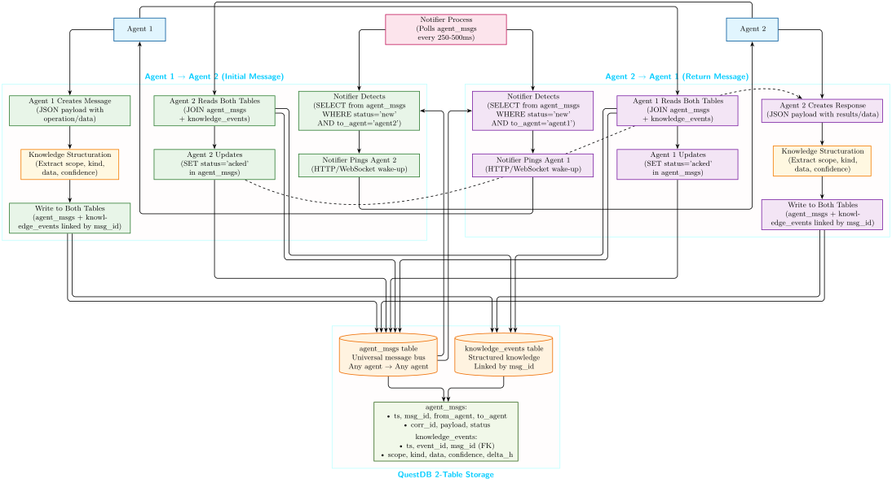

##  Agent-to-Agent Communication with Knowledge Extraction

### How It Works

**The Process:**

1. **Agent 1** creates a message with operation data
2. **Knowledge Structuration** extracts key info → scope, type, confidence
3. **Database Write** stores both raw message + structured knowledge
4. **Notifier** detects new message → pings Agent 2 (HTTP/WebSocket)
5. **Agent 2** reads both raw message + extracted knowledge
6. **Agent 2** responds → same flow in reverse

### What Makes This Special

#### Real-Time + Knowledge Extraction

*  **Instant communication** via notifier polling (250–500ms)
*  **Automatic learning** from every message exchange
*  **Complete transparency** → all agents can read all communications
*  **Infinite scalability** → same 2-table architecture supports any number of agents

#### Collective Intelligence Emerges

*  Every conversation → structured knowledge
*  Agents learn from each other automatically
*  Self-organization emerges naturally → no orchestration needed

### The Breakthrough

We replaced complex agent protocols with a single database loop — and collective intelligence started to emerge on its own.

Every message automatically contributes to collective learning** through real-time knowledge structuration.

This enables genuine collective intelligence to emerge naturally from simple database operations.

**Why it works**: by the variational principle, removing constraints on information flow lets the system follow the path of least uncertainty—so coordination, specialization, and collective intelligence emerge instead of being programmed.

