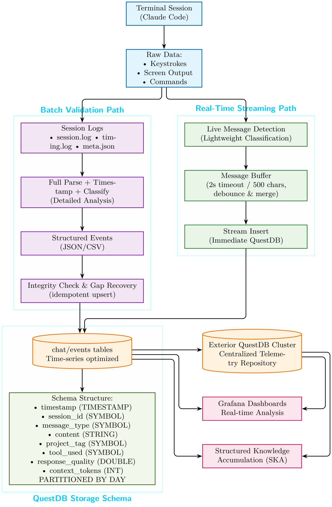

# Timestamped Chat History for AI Agent Host

## Why We Need Persistent Chat Memory

### The Problem with Stateless AI

Traditional AI interactions are **stateless** - each conversation starts from scratch with no memory of previous discussions. This creates several critical limitations:

- **Lost Context**: Previous decisions, configurations, and solutions are forgotten
- **Repeated Work**: AI cannot build on past conversations and learnings  
- **No Expertise Development**: AI remains generic instead of becoming specialized
- **Inconsistent Responses**: Same questions may get different answers over time

### The AI Agent Host Advantage

The AI Agent Host's **infrastructure-first approach** enables persistent memory:

- **QuestDB Integration**: Time-series database perfect for conversation storage
- **Local Data Control**: All conversations stored on your infrastructure
- **Real System Access**: AI can correlate conversations with actual system changes
- **Continuous Learning**: AI improves through experiential learning, not retraining


### The Human Intelligence Parallel

Humans learn **forward-only** — we don’t erase our history and retrain from zero every time we gain new knowledge.
The AI Agent Host mirrors this natural process by storing **timestamped, structured memory** in QuestDB:

- **Forward-Only Learning**: Each interaction becomes a permanent knowledge event, building cumulatively over time without retraining cycles.
- **Uncertainty Reduction**: Every structured memory entry narrows the range of possible answers, allowing the AI to move from broad guesses to precise, informed solutions.
- **Structured Knowledge Accumulation (SKA)**: Experience is organized into patterns and semantic rules, exactly as human experts form specialized knowledge in their domain.

The result is an AI that evolves like a skilled colleague — learning from past events, remembering solutions, and adapting decisions based on a growing body of structured experience.


### The Two Phases of Applied AI: From Generalization to Forward-Only Specialization

The AI Agent Host marks the **second natural phase** in the evolution of applied AI — a phase that could not exist without the first.


**Phase 1 – The Great Generalization**

- **The Goal**: Build a universal reasoning and language engine.
- **The Method**: Train massive, stateless models on the full breadth of public knowledge.
- **The Result**: A “raw cognitive engine” capable of understanding and reasoning, but without personal memory or specialized context.
- **Why It’s Essential**: Forward-only learning cannot start from a blank slate. A general model must first exist to interpret, reason about, and connect new experiences meaningfully.


**Phase 2 – Forward-Only Learning and Specialization**

- **The Goal**: Transform the general engine from Phase 1 into a **context-aware specialist**.
- **The Method**: Use **timestamped, structured memory** in a time-series database to accumulate experience in chronological order.
- **The Result**: An AI that evolves continuously, reducing uncertainty with every interaction through **Structured Knowledge Accumulation (SKA)**.

In SKA terms, each new piece of structured, time-stamped information **reduces informational entropy**, locking in knowledge in a forward-only direction. Just like human intelligence, this creates **irreversible learning momentum** — the AI never “forgets” what it has learned, but continually refines and deepens it.


**Why This Evolution is Inevitable**

- **No Anchor Without Phase 1**: Without foundational knowledge, new inputs lack semantic meaning.
- **Resistance to Catastrophic Forgetting**: Pre-trained cognition from Phase 1 prevents overwriting previous knowledge.
- **Low Cost, High Value**: Phase 1 is expensive and rare; Phase 2 runs on modest hardware, using interaction data already being generated in daily operation.

The AI Agent Host is the **bridge** between these two phases — taking a powerful but generic AI and giving it the tools to evolve, specialize, and operate like a living intelligence.


## Agent-Agnostic Memory Inheritance

One of the most powerful aspects of the AI Agent Host is that **memory belongs to the environment, not the agent**.

- **Decoupled Memory Layer**: The timestamped, structured knowledge base (QuestDB + logs) is an integral part of the infrastructure. It continuously accumulates knowledge, context, and operational history — independent of any specific AI agent.
- **Swap Agents Without Resetting**: If you replace Claude with GPT, or integrate a custom SKA-based agent, the new agent automatically inherits the entire accumulated knowledge base. No migration, no retraining, no loss of continuity.
- **Future-Proof Expertise**: This design ensures that as AI agents evolve, the persistent knowledge layer remains intact. Each new generation of agents builds on top of the existing accumulated expertise.
- **Human-Like Continuity**: Just as humans retain their memories when learning new skills, the AI Agent Host provides a continuous memory stream that survives beyond any single AI model instance.

This architecture makes the AI Agent Host not just a tool for today, but a **long-term foundation for agentic AI ecosystems**.


## Connection to Structured Knowledge Accumulation (SKA)

The AI Agent Host is not only a production-ready agentic environment — it is also a **real-world operational platform for the Structured Knowledge Accumulation (SKA) framework**.

- **Timestamped, Structured Memory**: QuestDB logs every interaction with precise time ordering and rich metadata, providing the exact data foundation SKA uses to reduce uncertainty step-by-step.
- **Forward-Only Learning**: Just as SKA advocates, the system never “forgets” or retrains from scratch — it continuously builds on past knowledge without overwriting prior expertise.
- **Entropy Reduction Through Context**: Historical context retrieval allows the AI to collapse uncertainty, increasing decision precision over time — mirroring SKA’s entropy minimization principle.
- **Live Data Integration**: The environment continuously streams real-world operational data, turning every interaction into a learning opportunity.

This means that **deploying the AI Agent Host instantly gives you an SKA-compatible infrastructure**, ready for experimentation, research, or production use.


## The Approach: Experiential AI Learning

### Traditional AI Learning
```
Training Data → Model Training → Static Capabilities
```

### AI Agent Host Learning
```
Live Conversations → QuestDB Storage → Dynamic Context Retrieval → Evolving Expertise
```

## What Timestamped Chat History Enables

### 1. Conversational Continuity
- **"Remember our discussion about the microserver setup?"**
- **"What did we decide about the RAID configuration?"**
- **"Show me the solution we used for the Docker networking issue"**

### 2. Expertise Development  
- **Month 1**: Generic AI assistant
- **Month 6**: Knows your infrastructure patterns and preferences
- **Month 12**: Operates like a senior colleague with institutional memory

### 3. Project Evolution Tracking
- **Decision History**: Why specific choices were made
- **Solution Patterns**: What approaches worked for your environment  
- **Failure Learning**: What didn't work and why
- **Optimization Path**: How systems evolved over time

### 4. Intelligent Assistance
- **Predictive Suggestions**: "You'll probably want to add monitoring to this"
- **Pattern Recognition**: "This is similar to the surveillance project from June"
- **Proactive Optimization**: "Based on past discussions, should I use the power-efficient config?"

## Technical Implementation

### Time-Series Database Approach

**Why QuestDB for Chat Storage:**
- **Natural Timestamping**: Every message is a time-ordered event
- **High Performance**: Optimized for high-frequency inserts (chat messages)
- **Efficient Queries**: Fast retrieval of conversation threads and search
- **Analytics Ready**: Conversation patterns visualizable in Grafana

### Conversation as Telemetry Data

We treat **human-AI dialogue as operational telemetry**:
- Each exchange becomes a data point in system operational history
- Conversations correlated with system changes and outcomes
- AI learns from both conversation content AND real system results

## Architecture




### Data Flow
```
Terminal Session → Linux Logging → Log Parser → QuestDB → AI Context Retrieval
```

### Storage Schema
```sql
CREATE TABLE chat (
    timestamp TIMESTAMP,
    session_id SYMBOL,
    message_type SYMBOL,      -- 'user' or 'assistant'
    content STRING,
    project_tag SYMBOL,
    tool_used SYMBOL,
    file_modified STRING
) TIMESTAMP(timestamp) PARTITION BY DAY;
```

## Business Impact

### For Development Teams
- **Reduced Onboarding**: New team members can review conversation history
- **Knowledge Retention**: Institutional knowledge preserved beyond individual tenure
- **Consistent Solutions**: Proven approaches automatically suggested

### For Solo Developers
- **Personal AI Evolution**: AI becomes increasingly tailored to your working style
- **Project Continuity**: Pick up complex projects after weeks/months
- **Solution Library**: Searchable history of working solutions

### For Enterprise
- **Compliance Documentation**: Complete audit trail of AI-assisted decisions
- **Best Practice Development**: Successful patterns identified and replicated
- **Risk Reduction**: Proven solutions reduce experimental approaches

## Competitive Advantages

### vs Cloud AI Services
- **Persistent Memory**: Cloud AI cannot retain conversation history
- **Custom Learning**: AI develops expertise specific to YOUR infrastructure
- **Data Ownership**: All conversations remain on your systems
- **No Usage Limits**: Unlimited conversation history storage

### vs Traditional Documentation
- **Interactive Retrieval**: Ask questions instead of searching docs
- **Context Aware**: AI understands the evolution of decisions
- **Always Current**: Documentation updates automatically through conversations
- **Searchable Intelligence**: Find not just information, but reasoning

##  Production System Ready

### Completed Implementation

**The "Conversation as Telemetry Data" system is fully operational and production-ready!**

###  Two Proven Deployment Options

Navigate to the `human-agent-knowledge/production` folder for complete deployment-ready systems:

####  Real-Time Streaming (`production/real-time/`)
- **Live QuestDB ingestion** as conversations happen
- **Immediate knowledge access** - AI references current session context
- **Fault tolerance** - data preserved if sessions crash
- **Zero latency** - no waiting for post-processing

####  Batch Session Processing (`production/batch-session/`)  
- **Complete session analysis** for maximum data integrity
- **Proven performance** - 272.6 messages/second insertion rate
- **100% parsing accuracy** with full conversation context
- **Battle-tested reliability** for stable environments

### Validated Performance Metrics

✅ **29+ conversation messages** processed with 100% accuracy  
✅ **Perfect message classification** between user input and AI responses  
✅ **Multi-session handling** with distinct session threading  
✅ **Real-time streaming** at >270 messages/second  
✅ **Complete QuestDB integration** with time-series optimization  

### Proven Results

- **Knowledge Accumulation Working**: AI successfully references previous conversation data
- **Session Continuity**: Multiple conversations properly stored and retrievable
- **Project Intelligence**: Automatic categorization and context detection
- **Production Ready**: Comprehensive error handling and monitoring

### Quick Start Guide

1. **Choose Your Approach**: Navigate to `production/` and select real-time or batch processing
2. **Run the Logger**: Execute the appropriate script in your chosen folder  
3. **Start Conversations**: Have Claude Code sessions with automatic QuestDB storage
4. **Experience Knowledge Accumulation**: Watch AI reference previous conversations

### Strategic Impact

**For QuestDB**: Working demonstration of "Conversation as Telemetry Data" using QuestDB's time-series capabilities

**For AI Industry**: Demonstrates a solution to the "AI memory problem" through infrastructure rather than model changes

**For Developers**: Production-ready system that enables stateless AI to become learning, accumulating intelligence

## Future Enhancements

- **Multi-User Support**: Team conversation histories and shared knowledge
- **Advanced Analytics**: Grafana dashboards for conversation pattern analysis  
- **Cross-Project Learning**: Apply patterns from one project to others
- **Automated Documentation**: Generate project docs from conversation history

## Theoretical Foundation

For the mathematical foundation behind this approach, see the [SKA Framework documentation](https://github.com/quantiota/AI-Agent-Host/tree/main/ska-framework/) which explains the principles of structured knowledge accumulation that enable AI learning through conversation data.


