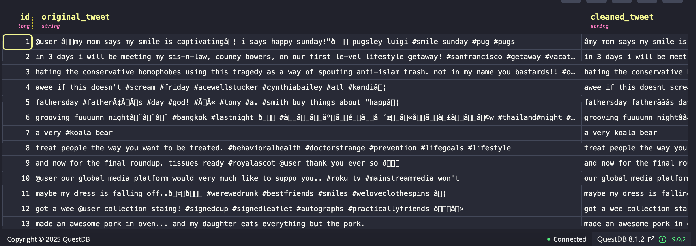

# Twitter Sentiment Analysis with QuestDB

A comprehensive machine learning project for classifying Twitter data sentiment analysis using Python and storing results in QuestDB time-series database.

## 📋 Project Overview

This project performs **sentiment classification** on Twitter datasets by:
- Automatically downloading Twitter sentiment datasets from online sources
- Cleaning and preprocessing tweet text data
- Applying machine learning models for sentiment analysis
- Storing results with metadata in QuestDB for time-series analysis
- Providing comprehensive logging and performance metrics

## 🤖 Machine Learning Models Used

### Primary Models:
1. **TextBlob Sentiment Analysis**
   - **Algorithm**: Rule-based sentiment analysis using lexical approach
   - **Features**: Polarity scoring (-1 to +1), Subjectivity analysis
   - **Classification**: 3-class (Positive, Negative, Neutral)


### Classification Logic:
```python
# Sentiment Classification Rules
if polarity > 0.1:     → 'positive'
elif polarity < -0.1:  → 'negative' 
else:                  → 'neutral'
```

## 🛠️ Technologies & Libraries

### Core Dependencies:
```
pandas>=1.3.0           # Data manipulation and analysis
numpy>=1.21.0           # Numerical computing
psycopg2-binary>=2.9.0  # PostgreSQL database adapter
requests>=2.25.0        # HTTP library for dataset downloads
textblob>=0.17.1        # Natural language processing
transformers>=4.20.0    # Hugging Face transformers (optional)
torch>=1.12.0           # PyTorch for deep learning (optional)
scikit-learn>=1.0.0     # Machine learning utilities
```

### Additional Libraries:
```
logging                 # Built-in logging functionality
re                     # Regular expressions for text cleaning
datetime               # Date and time handling
concurrent.futures     # Parallel processing
traceback             # Error handling and debugging
```

## 📦 Installation

### Option 1: Direct pip install on vscode
```bash
pip install pandas numpy psycopg2-binary requests textblob transformers torch scikit-learn
```

### Option 2: Using requirements.txt
Place the below dependencies in `requirements.txt` file in the path /docker/vscode/requirements.txt

```txt
pandas>=1.3.0
numpy>=1.21.0
psycopg2-binary>=2.9.0
requests>=2.25.0
textblob>=0.17.1
transformers>=4.20.0
torch>=1.12.0
scikit-learn>=1.0.0
```


## 📊 Dataset Processing Pipeline

### 1. **Dataset Download**
- **Source**: GitHub repositories with Twitter sentiment datasets
- **Default URL**: `https://raw.githubusercontent.com/sharmaroshan/Twitter-Sentiment-Analysis/refs/heads/master/train_tweet.csv`


### 2. **Data Preprocessing**
```python
# Text Cleaning Steps:
- Remove URLs and links
- Remove user mentions (@username)
- Remove hashtags symbols but keep content
- Remove special characters
- Convert to lowercase
- Remove extra whitespace
- Filter tweets < 3 characters
```

### 3. **Sentiment Analysis**
- **Input**: Cleaned tweet text
- **Processing**: TextBlob polarity analysis
- **Output**: Sentiment label + confidence score
- **Batch Size**: 1000 tweets per batch for optimal performance

### 4. **Database Storage**
Results are stored in QuestDB with comprehensive metadata.

## 🎯 QuestDB Table Schema

### Table: `twitter_sentiment`

| Column | Type | Description |
|--------|------|-------------|
| `id` | LONG | Unique tweet identifier |
| `original_tweet` | STRING | Raw tweet text |
| `cleaned_tweet` | STRING | Processed tweet text |
| `sentiment_label` | STRING | Classification result (positive/negative/neutral) |
| `sentiment_score` | DOUBLE | Polarity score (-1.0 to +1.0) |
| `confidence_score` | DOUBLE | Model confidence (0.0 to 1.0) |
| `word_count` | INT | Number of words in cleaned tweet |
| `char_count` | INT | Number of characters in cleaned tweet |
| `processing_time_ms` | LONG | Processing time in milliseconds |
| `created_at` | TIMESTAMP | Original timestamp |
| `processed_at` | TIMESTAMP | Processing timestamp |

### Sample QuestDB Data

```sql
SELECT * FROM twitter_sentiment LIMIT 5;
```

| id | original_tweet | cleaned_tweet | sentiment_label | sentiment_score | confidence_score | word_count | char_count | processing_time_ms | processed_at |
|----|----------------|---------------|-----------------|----------------|------------------|------------|------------|-------------------|--------------|
| 1 | @user âmy mom says my smile is captivatingâ i says happy sunday!âð pugsley luigi #smile sunday #pug #pugs | my mom says my smile is captivating i says happy sunday pugsley luigi smile sunday pug pugs | positive | 0.625 | 0.89 | 16 | 89 | 45 | 2025-08-18 12:11:37 |
| 2 | in 3 days i will be meeting my sis-n-law, couney bowers, on our first lc-vel lifestyle getaway! #sanfrancisco #getaway #vacat... | in 3 days i will be meeting my sisn-law couney bowers on our first level lifestyle getaway sanfrancisco getaway | positive | 0.45 | 0.72 | 19 | 98 | 52 | 2025-08-18 12:11:37 |
| 3 | hating the conservative homophobes using this tragedy as a way of spouting anti-islam trash. not in my name you bastards!! #o... | hating the conservative homophobes using this tragedy as a way of spouting antiislam trash not in my name you bastards | negative | -0.75 | 0.95 | 21 | 115 | 38 | 2025-08-18 12:11:37 |
| 4 | awee if this doesn't #scream #friday #acewellstucker #cynthiabailey #atl #kandiâ | awee if this doesnt scream friday acewellstucker cynthiabailey atl kandi | neutral | 0.05 | 0.15 | 10 | 65 | 41 | 2025-08-18 12:11:37 |
| 5 | fathersday #fatherâÂÂs #day #god! #â #tony #a. #smith buy things about "happâ | fathersday fathers day god tony a smith buy things about happ | neutral | 0.12 | 0.25 | 11 | 58 | 33 | 2025-08-18 12:11:37 |

## QuestDB Snippet

 

## 📊 Analytics Queries can be used on Grafana and create Dashboard for analysis

### Sentiment Distribution
```sql
SELECT sentiment_label, COUNT(*) as count, 
       ROUND(COUNT(*) * 100.0 / SUM(COUNT(*)) OVER(), 2) as percentage
FROM twitter_sentiment 
GROUP BY sentiment_label 
ORDER BY count DESC;
```


## 🔧 Configuration


# Processing Configuration
BATCH_SIZE=1000                    # Tweets per batch
MAX_WORKERS=4                      # Parallel threads
RETRY_ATTEMPTS=3                   # Retry failed operations
```

### Customization Options
```python
# Modify in main() function:
sample_size = 10000               # Number of tweets to process
url = "your_dataset_url_here"     # Custom dataset URL
filename = "custom_dataset.csv"   # Local filename
```


## 🙏 Acknowledgments

- **TextBlob**: Simple NLP library for sentiment analysis
- **QuestDB**: High-performance time-series database
- **Hugging Face**: Pre-trained transformer models
- **Twitter Dataset Contributors**: Open-source sentiment datasets

---

**🔗 Quick Links:**
- [Dataset Source](https://github.com/sharmaroshan/Twitter-Sentiment-Analysis) - Training data
- [TextBlob Documentation](https://textblob.readthedocs.io/) - NLP library docs